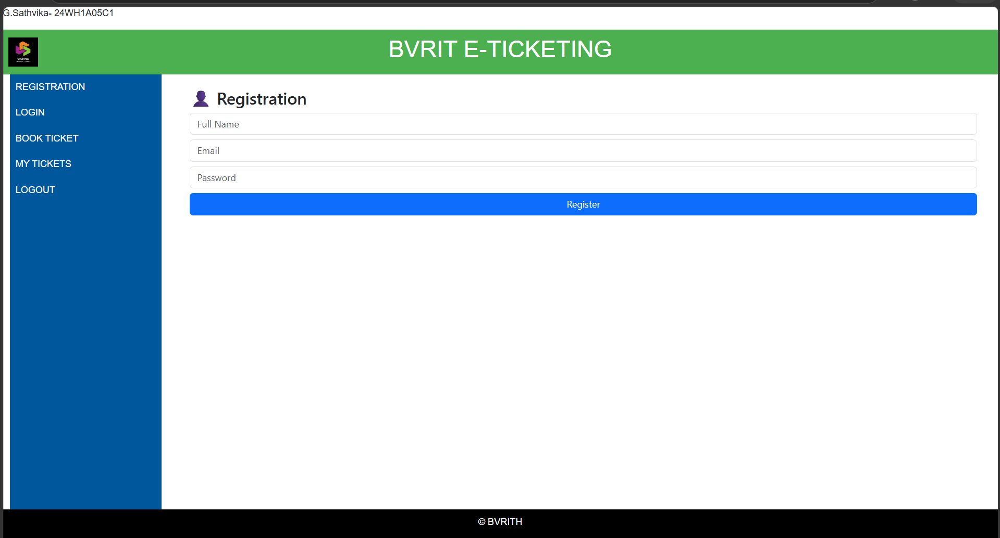
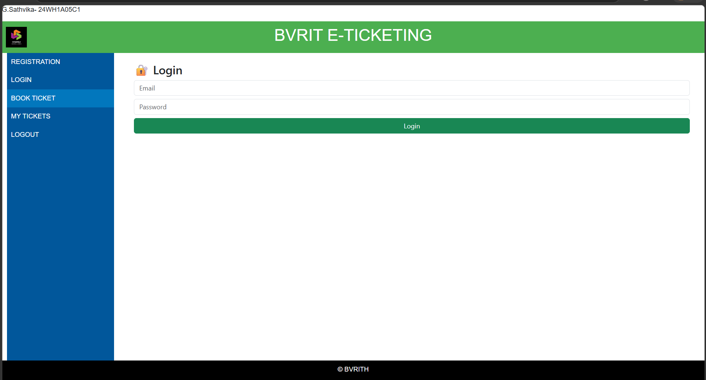
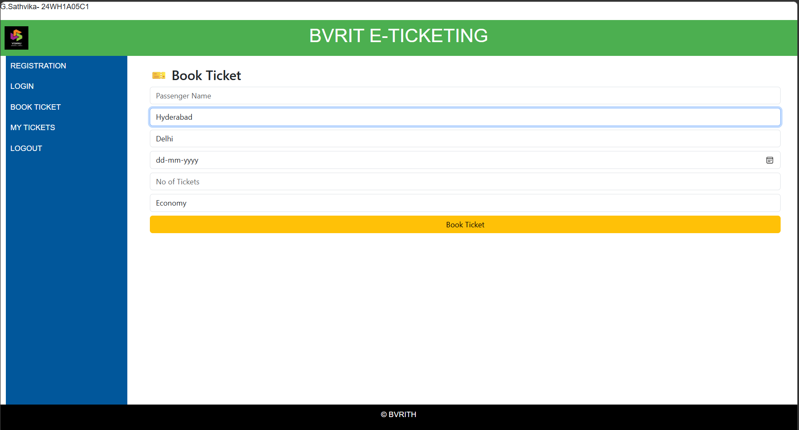
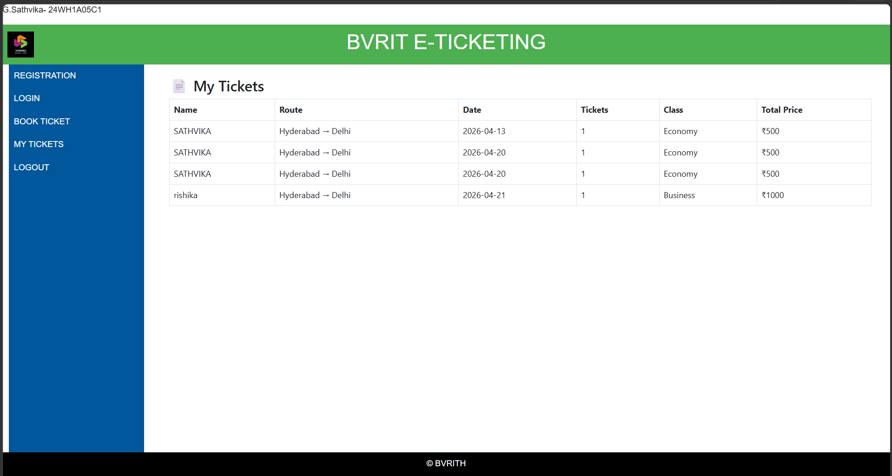
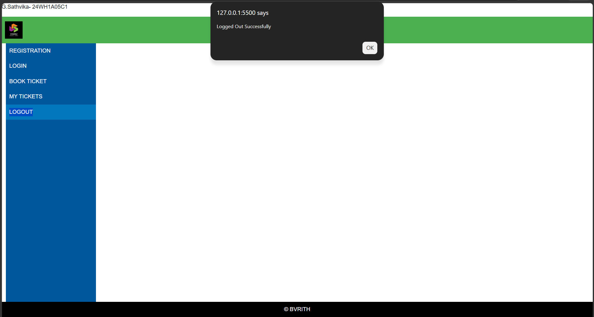

# 🎟️ E-Ticketing Web Application

A responsive **E-Ticketing Web Application** developed using modern web technologies like HTML5, CSS3, Bootstrap 5, and JavaScript.
This application enables users to register, log in, book tickets, and manage their bookings efficiently.

---

## 📌 Project Overview

This project simulates a real-world **online ticket booking system** with a clean and responsive user interface.
It demonstrates frontend development concepts along with client-side data storage using LocalStorage.

---

## ✨ Features

* 👤 User Registration
* 🔐 Secure Login System
* 🎫 Ticket Booking
* 📄 View Booked Tickets (My Tickets)
* 🚪 Logout Functionality
* 💾 Data stored using LocalStorage
* 📱 Fully Responsive Design using Bootstrap

---

## 🛠️ Technologies Used

* **HTML5**
* **CSS3**
* **Bootstrap 5**
* **JavaScript (LocalStorage)**

---

## 📂 Project Structure

```
E-Ticketing Application/
│── eticketing.html
│── registration.html
│── login.html
│── booking.html
│── mytickets.html
│── logout.html
│── eticket.css
│── outputs/
│    ├── registration.png
│    ├── login.png
│    ├── booking.png
│    ├── myTickets.png
│    ├── logout.png
│── README.md
```

---

## 📷 Output Screens

### 📝 Registration Page



---

### 🔑 Login Page



---

### 🎫 Ticket Booking Page




---

### 📄 My Tickets Page


---

### 🚪 Logout Page



---

## 🚀 How to Run the Project

1. Clone or download the repository
2. Open the project folder
3. Double-click `eticketing.html` or open it in a browser

---

## 🎯 Learning Outcomes

* Responsive Web Design using Bootstrap
* Form handling and validation
* Working with LocalStorage
* Structuring multi-page web applications

---

## 👩‍💻 Developed By

**Name:** *Gatla Sathvika*
**Roll No:** *24WH1A05C1*

